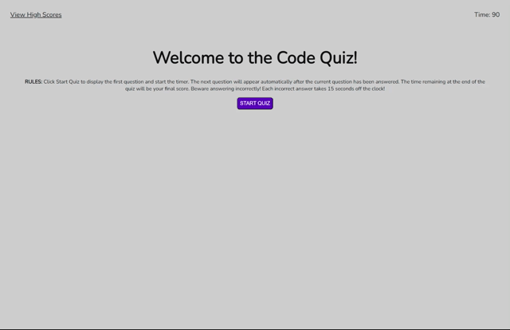

# Code Quiz

## Description

The purpose of this project was to create a mock code assessment to test the knowledge of potential Junior Developers prior to entering the workforce. Code assessments are a common and important part of the interview process and the creation of this quiz allowed us, as boot camp students, to understand what we may face during interviews. More importantly, it gave us a multifaceted problem that we had to break down into smaller parts, solve piece by piece, and then reassemble to create the final product.

The final product is a code related quiz that tells whether the user response was correct or incorrect before moving on to the next question. If a question is answered incorrectly, time is taken off the clock. The time remaining at the end of the quiz will be the user's final score. If the user misses enough questions to get the timer down to 0 seconds before answering all the questions the quiz will end automatically and take the user to the results page.

The results page will allow the user to type in their initials to store the score in local memory. The results will be added to the High scores page which can be accessed at any point via the link in the top left corner of the page.

To visit the Code Quiz click [here!](https://prich57.github.io/code-quiz/)

## Installation

N/A

## Usage

To use this Code Quiz, access the main page via the link in the description above. Once on the start page, the user should read the rules under the header before beginning the quiz. Once the rules have been read, the user should click the "Start Quiz" button to begin. 

Once the start button has been clicked, the first question of the quiz will appear. The user should select the answer they believe is correct. If correct, the user will see "Correct" displayed beneath the multiple choice answers before the next question loads automatically. The user should proceed through the quiz in this fashion, being notified of correct or incorrect responses along the way. If the user answers incorrectly too many times, the timer will run out before the end of the quiz and will trigger the results page to appear at that time. If, however, the user is able to get through all 10 questions, they will be taken to the results page and should enter their initials in the input field. Clicking submit on the results page without entering anything into the input field will trigger an alert to the user of improper usage and prompt them to enter their initials before clicking submit.

Once the user's initials have been entered successfully, they can visit the high scores page via the link in the top left of the viewport. This high scores page will store the scores locally, so any new attempt of the quiz on the same device will be stored along previous results. If the user would like to clear the history all they need to do is click the clear button on the bottom of the High Scores page.

## Mock-Up

The following gif shows the Code Quiz's appearance and functionality.

## Credits

N/A

## License

TBD